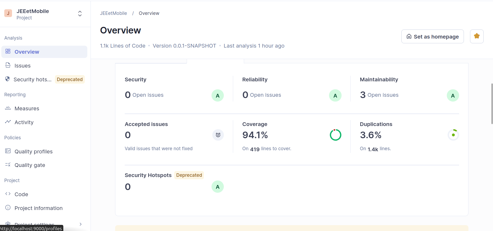
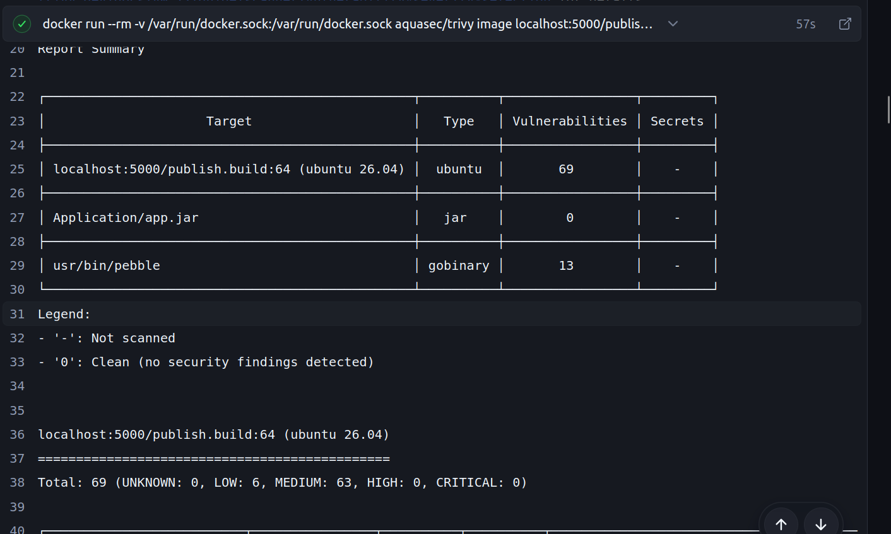
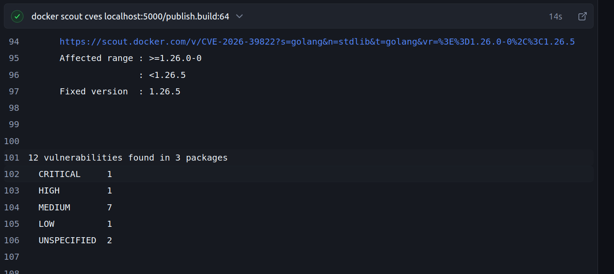
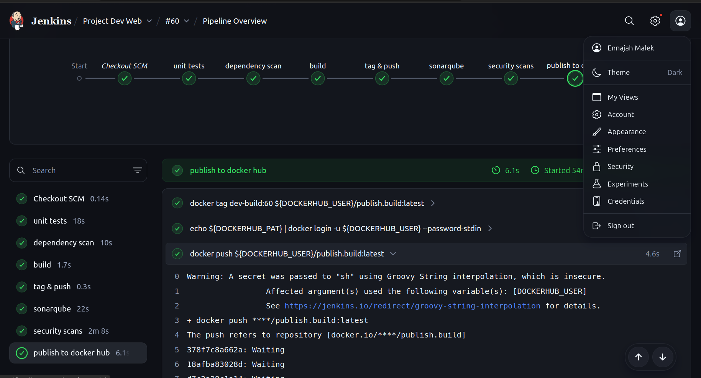

# Système de Gestion d'Usine — Plateforme SaaS

> Projet universitaire — Application web de gestion industrielle multi-tenant  
> Equipe de Projet: ENNAJAH Malek, SBAYI Douae, ELHOUDAIGUI Ilyas, MEJBER Ahmed Amine
---

## Description

Application SaaS de gestion d'usine permettant à chaque client (usine) de gérer de manière indépendante ses **utilisateurs**, son **stock de produits** et ses **commandes**, le tout avec un système complet de **traçabilité et de logs**, les videos sont trouvable dans le dossier **Demo** ou via le lien **https://drive.google.com/drive/folders/1_sfNaTCRYerHDwzrtFOSLfdmLxB2lbw1?usp=sharing**.

---

## Fonctionnalités principales

### Gestion des Utilisateurs & Rôles
- Création et gestion des comptes utilisateurs (nom, contact, email, mot de passe)
- Système de rôles granulaire par utilisateur :
  - Ajout / modification / annulation de commandes
  - Ajout / modification / suppression de produits
  - Accès administrateur
- L'administrateur dispose de tous les droits par défaut

### Gestion du Stock (Produits)
- Ajout, modification et suppression de produits
- Suivi des quantités, prix unitaires et descriptions
- Consultation des dashboards de ressources

### Gestion des Commandes
- Création, modification et annulation de commandes
- Suivi de l'état des commandes et du prix total
- Consultation des dashboards de commandes

### logs & Historique
- Historique complet de toutes les actions utilisateurs (avec horodatage)
- `Historique_Commandes` : traçabilité des commandes
- `Historique_Stockage` : traçabilité des mouvements de stock
- Accessible uniquement à l'administrateur

---

## Acteurs du système

| Acteur | Accès |
|---|---|
| **Super Administrateur** | Gestion de la plateforme globale, ajout de services/plateformes |
| **Administrateur (Usine)** | Gestion des utilisateurs, rôles, commandes, produits, logs |
| **Utilisateur (Usine)** | Selon les rôles attribués |
| **Analyste de Sécurité** | Gestion des logs, déclaration d'intrusions, blocage d'IP |

---

## Architecture & Déploiement SaaS

L'application est déployée en mode **multi-tenant** sur :

- **Microshift** —une outils moins couteux en comparaison avec openshift, elle est une outil orchestration des conteneurs, isolation par namespace par usine cliente, dans le repertoire **Saas** nous avons les fichiers de configurations **\*.yaml** qui sont generare automatiquement via **MicroShift** , le script **boot.sh** est utilise pour deplaoyer un nouveau tennant via **./boot.sh <nom_tennant>** un counteneur (compose d'application springboot et SGBD Mysql ) avec un acces via un port alloue et cree

- **Gestion des Logs ** avec un script **/SaaS/log.sh**, nous allons deployer un image loki, grafana et promtail pour le **tracking** des logs, vous pouvez voir la video ou on voit les logs pour les tennants trouve dans **MicroShift**
  

### Pipeline CI
**Stages:**
1. **Unit Tests** — runs `mvn test`, les tests unitaires pour valider le build
2. **Dependency Scan** — OWASP Dependency-Check against project dependencies (CVEs), cle NVD API est necessaire
3. **Build** — on fait le build d'application Spring Boot + MySQL via Docker Compose
4. **Tag & Push** — ajoute d'un tag et publication dans un registre locale pour les tests "registry2"
5. **Static Analysis** — SonarQube analysis (les bugs, test coverage ~= 97% couverage)
6. **Security Scans** — Trivy and Docker Scout scan l'image pour chercher les vulnerabilites
7. **Publish** — publication de l'image `:latest` et push a Docker Hub

### Sécurité & Analyse de Code
- **SonarQube** — qualité et couverture de code
- 

- **OWASP Dependency-Check** — vulnérabilités dans les dépendances
- **SAST**  Trivy et docker scout— analyse statique de sécurité
  
- on observe que l'application n'a pas des vulnerabilites des packages selon trivy mais l'image contient **63 MEDIUM** et **3** **LOW** selon l'image **Ubuntu 26.04**

  
- docker scout utilise d'autre maniere et il a aussi trouve aucun probleme 
- **Authentification** obligatoire pour l'accès plateforme et serveur

---

## Modèle de données (résumé)

| Entité | Champs clés |
|---|---|
| `User` | id, username, password, name, contact, email |
| `Roles` | permissions par action (Bool), lien user |
| `Produit` | id, nom, quantité, prix unitaire, description |
| `Commande` | id, produit_id, quantité, prix total, état |
| `Historique` | id, user_id, description, timestamp, date |
| `Historique_Commandes` | lien historique ↔ commande |
| `Historique_Stockage` | lien historique ↔ produit |

